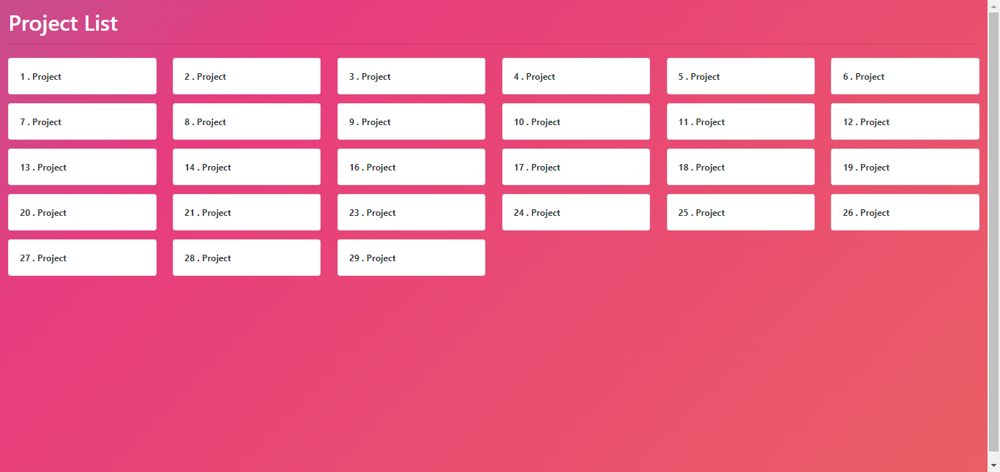

# Localhost index file 

Change the default index view in localhost

## Installation

1. Clone the repository:

   ```bash
   git clone https://github.com/your-username/laravel-blog.git
   ```

2. Navigate to the localhost web directory:

   ```bash
   cd htdocs(XAMPP)  or  www(Larahon)
   ```

3. Replace the default index file:

   ```bash
   replace index.php 
   ```
4. For style copy the style file:

   ```bash
   copy style file 
   ```

5. Start the apache server:

     Access the application at [http://localhost/](http://localhost/).

## Demo




## License

This project is open-source and available under the [MIT License](LICENSE).
